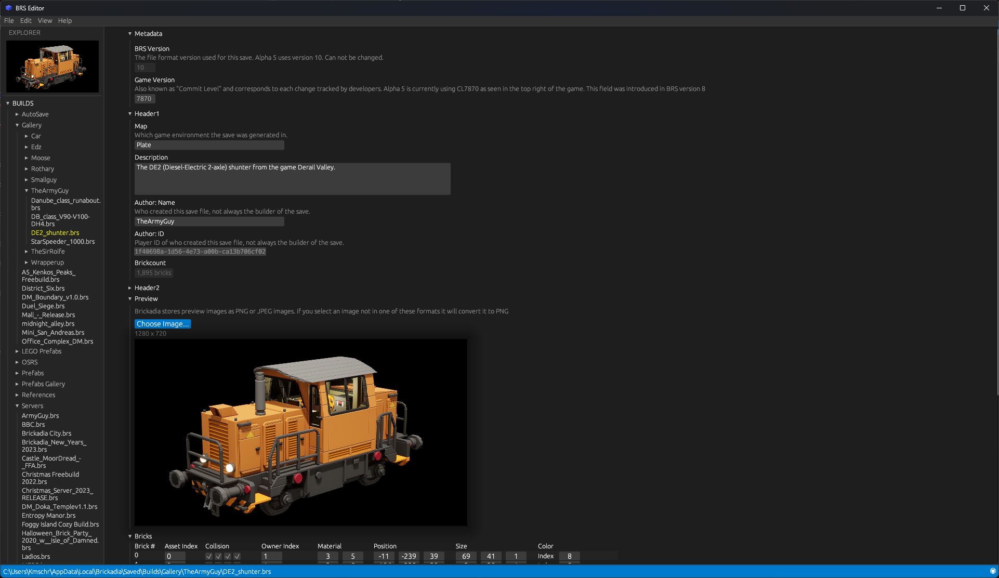

# BRS-Edit

BRS-Edit is a fan-made tool for editing savefiles for Brickadia, a multiplayer brick building game. It uses egui to provide a native desktop application.

## Warning
!!!Please!!! make a **backup** of saves before manipulating them. It is very possible to edit saves such that they will not load properly and this tool does not protect you from doing so

## Current Features
### Exports
- Export the save preview image

### Save Editing
- Delete bricks by characteristics (all bricks of a certain color, owner, etc)
- Edit properties of each individual brick
- Edit save palette and brick assets
- Insert a custom image for the save preview

## Planned features
### Save Editing
- Transfer ownership of bricks from one player to another
- Modify components
    - Enable/Disable shadows on light components
    - Constrain max radius of lights
    - Remove certain components
- Affine transformations (translate, rotate, scale)

### Imports
- Import blockland saves BLS (builtin bls2brs)
- Import models OBJ (builtin obj2brs)
- Import heightmap (builtin heightmap2brs)

### Exports
- Export save colors as a color palette preset
- Export as OBJ

## 

Special thanks to *voximity* for maintaining `brickadia-rs`
